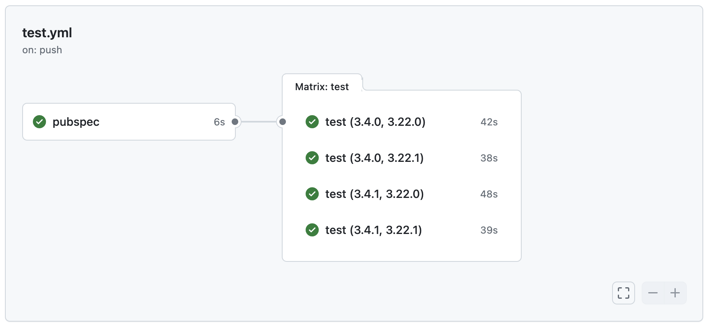

[GitHub Action]: https://github.com/flutter-actions/setup-flutter
[MIT License]: https://github.com/flutter-actions/setup-flutter/blob/main/LICENSE

> [!NOTE]
> This action is still in development and may not work as expected.

# About
This [GitHub Action] generates a matrix of Dart and Flutter SDK versions from a `pubspec.yaml` file.

## Inputs

The action takes the following inputs:
  * `pubspec`: The path to the pubspec.yaml file. Default: `pubspec.yaml`.
  * `channel`: The Flutter channel to use when resolving the Flutter SDK version. Default: `any`
  * `strict`: If `true`, the action will assert constraints on the Dart SDK version bundled with the Flutter SDK to ensure compatibility. Default: `false`

## Outputs

- `matrix`: A JSON string representing the matrix of both Dart and Flutter SDK versions.
- `dart`: The Dart SDK specific versions.
- `flutter`: The Flutter SDK specific versions.

## Usage
```yaml
name: test

on:
  push:

jobs:
  pubspec:
    runs-on: ubuntu-latest
    steps:
    - uses: actions/checkout@v4

    - id: pubspec
      name: Generate matrix from pubspec.yaml
      uses: flutter-actions/pubspec-matrix-action@v1
      with:
        pubspec: 'pubspec.yaml'
    outputs:
      matrix: ${{ steps.pubspec.outputs.matrix }}

  test:
    needs: pubspec
    runs-on: ubuntu-latest
    strategy:
      matrix: ${{fromJson(needs.pubspec.outputs.matrix)}}
    steps:
    - uses: actions/checkout@v4

    - uses: flutter-actions/setup-flutter@v2
      with:
        version: ${{ matrix.flutter }}
        channel: stable

    - run: flutter pub get
    - run: flutter test

```

**Example**

<picture>
    <source srcset=".github/assets/screenshot-dark.png"  media="(prefers-color-scheme: dark)">
    
</picture>

# License

Licensed under the [MIT License].
